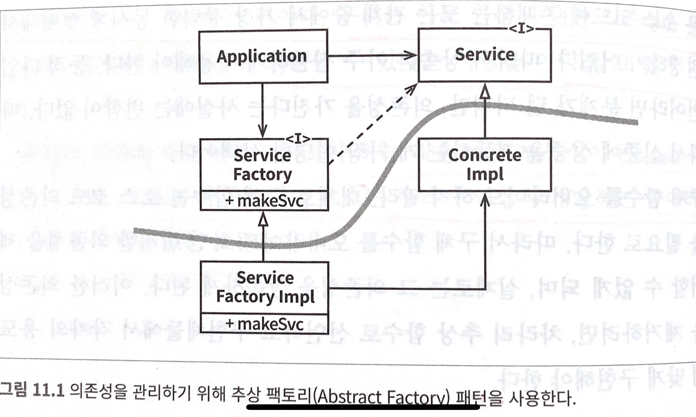

# 11장 DIP: 의존성 역전원칙
의존성 역전 원칙에서 말하는, 유연성이 극대화된 시스템이란 소스코드 의존성이 추상에 의존하며 구체(concretion)에는 의존하지 않는 시스템이다.

DIP를 논할때 운영체제나 플랫폼 같이 안정성이 보장된 환경에 대해서는 무시하는 편이다.
우리는 이들 환경에 대한 의존성은 용납하는데, 변경되지 않는다면 의존할 수 있다는 사실을 이미 알고 있기 때문이다.

우리가 의존하지 않도록 피하고자 하는 것은 바로 변동성이 큰 구체적인 요소다.
그리고 이 구체적인 요소는 우리가 열심히 개발하는 중이라 자주 변경될수 밖에 없는 모듈들이다.

## 안정된 추상화
추상 인터페이스에 변경이 생기면 이를 구체화한 구현체들도 따라서 수정해야 한다.
반대로 구체적인 구현체에 변경이 생기더라도 그 구현체가 구현하는 인터페이스는 대다수의 경우 변경될 필요가 없다.
따라서 인터페이스는 구현체보다 변동성이 낮다.

안정된 소프트웨어 아키텍처란 변동성이 큰 구현체에 의존하는 일은 지양하고, 안정된 추상 인터페이스를 선호하는 아키텍처라는 뜻이다.

구체적인 코딩 실천법
+ 변동성이 큰 구체 클래스를 참조하지 말라.
  + 대신 추상 인터페이스를 참조하라. 이 규칙은 객체 생성 생성 방식을 강하게 제약하며, 일반적으로 추상 팩토리(Abstract Factory)를 사용하도록 강제한다.
+ 변동성이 큰 구체 클래스로부터 파생하지 말라.
  + 정적 타입 언어에서 상속은 소스 코드에 존재하는 모든 관계 중에서 가장 강력한 동시에 뻣뻣해서 변경하기 어렵다.
+ 구체함수를 오버라이드 하지말라.
  + 대체로 구체함수는 소스 코드 의존성을 필요로 한다. 따라서 구체함수를 오버라이드 하면 그 의존성을 상속하게 된다.
  + 이런한 의존성을 제거하려면, 차라리 추상 함수로 선언하고 구현체들에서 각자의 용도에 맞게 구현해야 한다.
 
## 팩토리
변동성이 큰 구체적인 객체는 특별히 주의해서 생성해야 한다.
사실상 모든언어에서 객체를 생성하려면 해당 객체를 구체적으로 정의한 코드에 대해 소스 코드 의존성이 발생하기 때문이다.

자바 등 대다수의 객체 지향 언에서 이처럼 바람직하지 못한 의존성을 처리할때 추상 팩토리를 사용하곤 한다.

그림 11.1에서 추상 팩토리를 사용한 구조를 볼 수 있다.

그림 11.1의 곡선은 아키텍처 경계를 뜻한다.
이곡선은 구체적인 것들로부터 추상적인 것들을 구분한다.
소스코드 의존성은 해당 곡선과 교차할 때 모두 한 방향. 즉 추상적인 쪽으로 향한다.

제어흐름은 소스 코드 의존성과는 정방대로 방향으로 곡선을 가로지른다는 점에 주목하자.
다시 말해 소스 코드 의존성은 제어흐름과는 반대 방향으로 역전된다.
이러한 이유로 이 원칙을 의존성 역전 Dependency Inversion 이라고 부른다.

## 결론
그림 11.1의 곡선으 이후의 장에서는 아키텍처 경계가 될 것이다.
그리고 의존성은 이 곡선을 경계로, 더 추상적인 엔티티가 있는쪽으로 향한다.
추후 이 규칙은 의존성 규칙 Dependency Rule이라 부를것이다.
