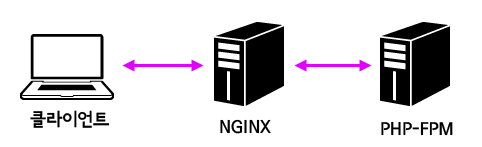
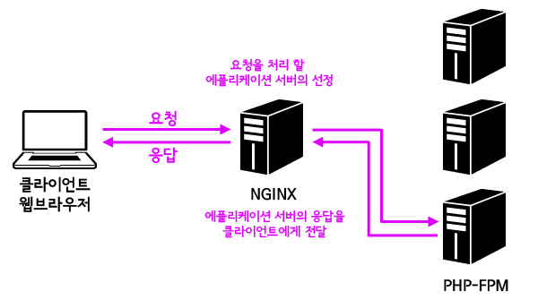
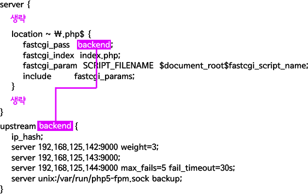

# Upstream

## Application Server
일반적으로 웹서버는 (이미지와 같은) 정적인 데이터를 서비스하기 때문에 적은 컴퓨팅 파워로도 많은 요청을 처리할 수 있다. 
하지만 PHP, Python, Ruby와 같은 언어로 만든 에플리케이션은 많은 연산을 하기 때문에 웹서버 보다 훨씬 더 많은 자원을 사용한다. 
FastCGI를 사용하면 전통적으로 웹서버와 동일한 머신에서 동작하던 웹에플리케이션을 별도의 서버로 분리 할 수 있다. 
이렇게 웹서버에서 분리된 서버를 에플리케이션 서버라고 한다. 
아래의 그림에서는 PHP-FPM이 에플리케이션 서버다. 


## Upstream
Upstream 서버는 다른 말로 Origin 서버라고도 한다. 
즉 여러대의 컴퓨터가 순차적으로 어떤 일을 처리 할 때 어떤 서비스를 받는 서버를 의미한다. 
위의 그림에서 업스트림 서버는 PHP-FPM이 설치된 서버이고, 이 맥락에서 NGINX는 Downstream 서버라고 할 수 있다.

## Upstream Module
업스트림 모듈은 NGINX에 내장된 모듈로 엔진엑스로 부하분산, 속도 개선과 같은 역할을 할 수 있게 한다. 
아래 그림은 엔진엑스의 업스트림 모듈을 이용해서 한대의 웹서버에 여러대의 에플리케이션 서버를 붙이는 방법을 보여준다. 




## Upstream 설정
업스트림을 설정하기 위해서는 업스트림 블록을 이용한다. 업스트림 블록은 아래와 같은 형식을 갖는다.

### 형식

```bash
upstream 이름 {
    [ip_hash;]
    server host 주소:포트 [옵션];
    .....
}
```
### 옵션
옵션으로 올 수 있는 값은 아래와 같다.

- ip_hash : 같은 방문자로부터 도착한 요청은 항상 같은 업스트림 서버가 처리 할 수 있게 한다.
- weight=n : 업스트림 서버의 비중을 나타낸다. 이 값을 2로 설정하면 그렇지 않은 서버에 비해 두배 더 자주 선택된다.
- max_fails=n : n으로 지정한 횟수만큼 실패가 일어나면 서버가 죽은 것으로 간주한다.
- fail_timeout=n : max_fails가 지정된 상태에서 이 값이 설정만큼 서버가 응답하지 않으면 죽은 것으로 간주한다.
- down : 해당 서버를 사용하지 않게 지정한다. ip_hash; 지시어가 설정된 상태에서만 유효하다.
- backup : 모든 서버가 동작하지 않을 때 backup으로 표시된 서버가 사용되고 그 전까지는 사용되지 않는다.

### 예제
예를들면 아래와 같다.

```bash
upstream backend {
    ip_hash;
    server 192.168.125.142:9000 weight=3;
    server 192.168.125.143:9000;
    server 192.168.125.144:9000 max_fails=5 fail_timeout=30s;
    server unix:/var/run/php5-fpm.sock backup;
}
```
위의 설정을 풀어보면 아래와 같다.

같은 IP는 같은 업스트림 서버에 접속한다. (ip_hash) 192.168.125.142 서버는 다른 서버 대비 3배 더 자주 사용된다.
192.168.125.144 서버는 30초 동안 응답하지 않는 상태가 5번 지속되면 죽은 것으로 간주하고 더 이상 요청을 보내지 않는다. 
같은 호스트에 설치되서 소켓을 통해서 통신하는 FastCGI 에플리케이션은 백업용도이기 때문에 평소에는 사용하지 않다가 
나머지 서버들이 불능상태가 되었을 때 자동으로 활성화된다.

### 업스트림 설정의 적용
위의 설정은 적용해보자. PHP-FPM 설치 수업에서 사용했던 예제를 사용하겠다. 
이 부분은 언어를 불문하고 동일하게 적용될 수 있는 부분이다. 

upstream의 이름을 fastcgi_pass의 값으로 전달하면 된다. 아래의 그림을 참고하자.



위의 내용에 대한 전체 설정 내용을 보면 아래와 같다.

```bash
server {
    listen       80;
    server_name  localhost;
  
    #charset koi8-r;
    #access_log  /var/log/nginx/log/host.access.log  main;
  
    root   /usr/share/nginx/html;
    location / {
        index  index.html index.htm index.php;
    }
  
    #error_page  404              /404.html;
  
    # redirect server error pages to the static page /50x.html
    #
    error_page   500 502 503 504  /50x.html;
    location = /50x.html {
        root   /usr/share/nginx/html;
    }
  
    # proxy the PHP scripts to Apache listening on 127.0.0.1:80
    #
    #location ~ \.php$ {
    #    proxy_pass   http://127.0.0.1;
    #}
  
    # pass the PHP scripts to FastCGI server listening on 127.0.0.1:9000
    #
    location ~ \.php$ {
        fastcgi_pass   backend;
        fastcgi_index  index.php;
        fastcgi_param  SCRIPT_FILENAME  $document_root$fastcgi_script_name;
        include        fastcgi_params;
    }
  
    # deny access to .htaccess files, if Apache's document root
    # concurs with nginx's one
    #
    #location ~ /\.ht {
    #    deny  all;
    #}
}
 
 
upstream backend {
    ip_hash;
    server 192.168.125.142:9000 weight=3;
    server 192.168.125.143:9000;
    server 192.168.125.144:9000 max_fails=5 fail_timeout=30s;
    server unix:/var/run/php5-fpm.sock backup;
}
```

## 참고
[https://opentutorials.org/module/384/4328](https://opentutorials.org/module/384/4328)
