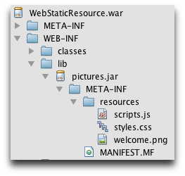

# Servlet 3.0으로 정적 컨텐츠 제공

(일명 WEB-INF/lib/{\*.jar}/META-INF/resources)

모듈성은 Java EE 6의 주제 중 하나이며, 서블릿 3.0 조각은 종종 이것의 한 예가됩니다.  
이미지, CSS 또는 JavaScript와 같은 정적 인 내용을 처리하기위한 서블릿 3.0 사양의 작지만 매우 유용한 새 기능에 관한 것입니다. 
Servlet 3.0 이전 버전에서는 이미지를 웹 응용 프로그램 루트에서 액세스 할 수있게 만들었지 만 
파일을 WAR 아카이브에 복사하여 최신 상태로 유지해야했습니다.  
이것은 확실히 웹 애플리케이션 개발 및 패키징과 긴밀하게 결합 된 솔루션을 의미했습니다.  
다른 옵션은 응용 프로그램 서버의 docroot에이 정적 컨텐츠를 배치하는 것이 었습니다.  
어플리케이션 서버의 docroot는 너무 느슨하게 결합되어있어 누구나 액세스 할 수 있으며 
모든 응용 프로그램이 동일한 정적 컨텐츠 세트를 사용할 것을 권장합니다.  
Servlet 3.0에서는 WEB-INF/lib 에있는 JAR에 웹 컨텍스트 루트에서 액세스 할 수있는 META-INF/resource 디렉토리의 정적 컨텐트가 있습니다.  
WEB-INF/lib/{\*.jar}/META-INF/resources 하여 이 이전 구문을 구문 분석 할 수도 WEB-INF/lib/{\*.jar}/META-INF/resources . 
따라서 더 이상 ServletContext getResource() 및 getResourceAsStream() 메소드를 약간 바보스런 재 작성과 함께 사용할 필요가 없습니다.  
이 간단한 웹 애플리케이션 WAR 예제에서 

 정적 리소스는 다음에서 사용할 수 있습니다.  
 http://host:port/ webcontext/ scripts.js  
 http://host:port/ webcontext /styles.css  
 http://host:port/ webcontext /welcome.png  
 여기서 http://host:port/ webcontext / 는 상대 경로 " ./ "로 바꿀 수 있습니다.  
 이것은 더 많은 모듈 응용 프로그램을 만듭니다.  
 이미지 이외에 이것이 CSS와 자바 스크립트에 어떻게 적용되는지 생각해보십시오.  
 전용 JAR (사실상 리소스 JAR)에서 jquery 나 dojo와 같은 JavaScript 라이브러리를 패키지하는 것이 좋습니다.  
 내가 생각할 수있는 다른 유스 케이스는 설정 파일입니다.  
 WEB-INF/lib/testing.jar 또는 WEB-INF/lib/production.jar 하여 배포 할 수 있습니다  
 WEB-INF/lib/testing.jar 각각은 서로 다른 내용의 META-INF/resources/config.properties 파일을 포함합니다.  
 구성을 읽는 응용 프로그램 코드는 항상 ./config.properties (또는 http://host:port/ webcontext /config.properties )를 사용하여 액세스합니다.  
 이 메커니즘은 JSP에도 적용되며 문서 루트에있는 리소스 파일이 우선 적용됩니다.  
 Servlet 3.0 사양 의 단락 10.5의 모든 세부 정보를 얻으십시오.

## 참고 링크
- [Serving Static Content with Servlet 3.0](https://alexismp.wordpress.com/2010/04/28/web-inflib-jarmeta-infresources/)
