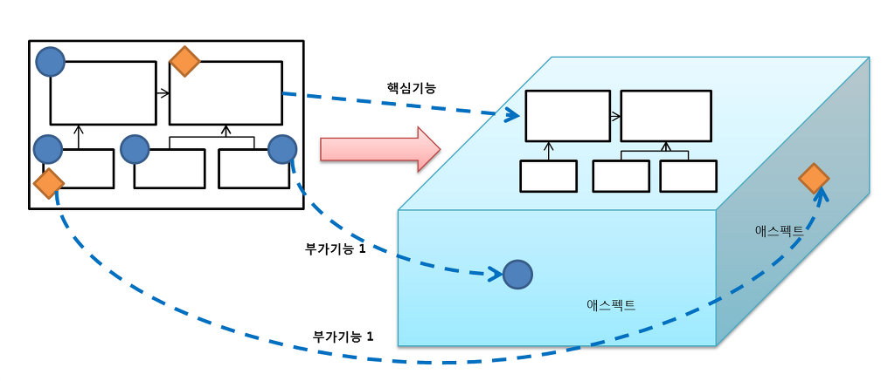

# 6.5 스프링 AOP

## 6.5.1 자동 프록시 생성
프록시 팩토리 빈 방식의 접근 방법의 한계라고 생각했던 두가지 문제
- 부가기능이 타깃 오브젝트마다 새로 만들어지는 문제는 스프링 ProxyFactoryBean의 어드바이스를 통해 해결
- 남은것은 부가기능의 적용이 필요한 타깃 오브젝트마다 거의 비슷한 내용의 ProxyFactoryBean 빈 설정정보를 추가해주는 부분

### 중복 문제의 접근 방법
지금 까지 다뤄봤던 반복적이고 기계적인 코드에 대한 해결책
- JDBC API를 사용하는 DAO 코드 -> 메소드마다 JDBC try/catch/finally 블록으로 구성된 비슷한 코드가 반복 
-- 이 코드는 바뀌지 않는 부분과 바뀌는 부분을 구분해서 분리하고 . 템플릿과 콜백, 클라이언트로 나누는 방법을 통해 해결 ->전락패턴 과 DI 적용한덕분

- 좀 다른 방법으로 반복되는 코드의 문제 -> 반복적인 위임코드가 필요한 프록시 클래스 코드
-- 변하지 않는 타깃으로의 위임과 부가기능 적용 여부 판단이라는 부분은 코드 생성기법을 이용하는 다이내믹 프록시 기술에 맡기곡,
-- 변하는 부가기능 코드는 별도로 만들어서 다이내믹 프록시 생성 팩토리에 DI로 제공하는 방법을 사용
-- 의미있는 부가기능 로직인 트랜잭션 경계설정은 코드로 만들게 하고, 기계적인 코드인 타깃 인터페이스 구현과 위임, 부가기능 연동 부분은 자동생성하게


반복적인 ProxyFactoryBean 설정 문제는 설정 자동등록 기법으로 해결 할수 없을까?
일정한 타깃빈의 목록을 제공하면 자동으로 각 타깃 빈에 대한 프록시를 만들어주는 방법이 있다면 ProxyFactoryBean 타입 빈 설정을 
매번추가해서 프록시를 만들어내는 수고를 덜수 있을거 같다.

### 빈 후처리기를 이용한 자동 프록시 생성기
스프링은 컨테이너로서 제공하는 기능 중에서 변하지 않는 핵심적인 부분외에는 대부분 확장할 수 있도록 확장 포인트를 제공해준다.
그중에서 관심을 가질만한 확장포인트는 바로 BeanPostProcessor 인터페이스를 구현해서 만드는 빈 후처리기다.
빈 후처리기는 이름 그대로 스프링 빈 오브젝트로 만들어지고 난 후에, 빈 오브젝트를 다시 가공할 수 있게 해준다.

DefaultAdvisorAutoProxyCreator는 어드바이저를 이용한 자동 프록시 생성기인 빈 후처리기 이다.
스프링은 빈 후처리기가 빈으로 등록되어 있으면 빈 오브젝트가 생성될 때마다 빈후처리기에 보내서 후처리 작업을 요청한다.
빈후처리기는 빈 오브젝트의 프로퍼티를 강제로 수정할수도 있고 별도의 초기화 작업을 수행할 수도 있다.
심지어는 만들어진 빈 오브젝트를 자체를 바꿔치기할 수도 있다.
따라서 스프링이 설정을 참고해서 만든 오브젝트가 아닌 다른 오브젝트를 빈으로 등록시키는 것이 가능하다.
이를 잘 이용하면 스프링이 생성하는 빈 오브젝트의 일부를 프록시로 포장하고, 프록시를 빈으로 대신 등록할 수도 있다.
바로 이것이 자동 프록시 생성 빈 후처리기다.

빈으로 등록된 모든 어드바이저 내의 포인트컷을 이용해 전달받은 빈이 프록시 적용 대상인지 확인한다.
프록시 적용대상이면 그때는 내장된 프록시 생성기에게 현재 빈에 대한 프록시를 만들게 하고, 만들어진 프록시에 어드바이저를 연결해준다.
빈 후처리기는 프록시가 생성되면 원래 컨테이너가 전달해준 빈 오브젝트 대신 프록시 오브젝트를 컨테이너에게 돌려준다.
컨테이너는 최종적으로 빈 후처리기가 돌려준 오브젝트를 빈으로 등록하고 사용한다.

적용할 빈을 선정하는 로직이 추가된 포인트컷이 담긴 어드바이저를 등록하고 빈 후처리기를 사용하면 일일이 ProxyFactoryBean 빈을 등록하지
않아도 타깃 오브젝트에 자동으로 프록시가 적용되게 할수 있다. 


### 확장된 포인트컷
두 가지 기능을 정의한 Pointcut 인터페이스
```java
public interface Pointcut {
    ClassFilter getClassFilter(); //프록시를 적용할 클래스인지 확인해준다.
    MethodMatcher getMethodMatcher();   //어드바이스를 적용할 메소드인지 확인해준다.
}
```
기존에 사용한 NameMatchMethodPointcut은 메소드 선별 기능만 가진 특별한 포인트 컷이다.
메소드만 션별한다는건 클래스 필터는 모든 클래스를 다 받아주도록 만들어져 있다는 뜻이다.
ProxyFactoryBean에서 포인트컷을 사용할때는 이미 타깃이 정해져 있기 때문에 포인트컷은 메소드 선별만 해주면 그만이다.
만약 Pointcut 선정 기능을 모두 적용한다면 먼저 프록시를 적용할 클래스인지 판단하고 나서, 적용 대상 클래스인 경우에는
어드바이스를 적용할 메소드인지 확인하는 식으로 동작한다.

모든 빈에 대해 프록시 자동 적용 대상을 선별해야 하는 빈 후처리기인 DefaultAdvisorAutoProxyCreator는 클래스와 메소드
선정 알고리즘을 모두 갖고 있는 포인트컷이 필요하다.

확장 포인트컷 테스트
```java
@Test
public void classNamePointcutAdvisor(){
    //포인트컷 준비
    NameMatchMethodPointcut classMethodPointcut = new NameMatchMethodPointcut(){
        public ClassFilter getClassFilter() {   //익명 내부 클래스 방식으로 클래스를 정의한다.
            return new ClassFilter(){
                public boolean match(Class<?> clazz){
                    return clazz.getSimpleName().startsWith("HelloT");  // 클래스 이름이 HelloT로 시작하는것만 선정한다.
                }
            };
        }
    };
    
    classMethodPointcut.setMappedName("sayH*"); //sayH로 시작하는 메소드 이름을 가진 메소드만 선정한다.
    
    //테스트
    checkAdviced(new HelloTarget(), classMethodPointcut,true);  //적용 클래스다
    
    class HelloWorld extends HelloTarget {};
    checkAdviced(new HelloWorld(), classMethodPointcut, false); // 적용클래스가 아니다.
}

private void checkAdviced(Object target, Pointcut pointcut, boolean adviced) { [3]  //adviced ->적용대상인가?
    ProxyFactoryBean pfBean = new ProxyFactoryBean();
    pfBean.setTarget(target);
    pfBean.addAdvisor(new DefaultPointcutAdvisor(pointcut, new UppercaseAdivce()));
    Hello proxiedHello = (Hello) pfBean.getObject();
    
    if(adviced){
        assertThat(proxiedHello.sayHello("Toby"), is("HELLO TOBY"));    // 메소드 선정 방식을 통해 어드바이스 적용
    } else {
        assertThat(proxiedHello.sayHello("Toby"), is("Hello Toby"));    //어드바이스 적용 대상 후보에서 아예터ㅏㄹ럭 
    }
        
}
```
포인트컷은 NameMatchMethodPointcut을 내부 익명 클래스 방식으로 확장해서 만들었다.
원래 모든 클래스를 다 받아주는 클래스 필터를 리턴하던 getClassFilter()를 오버라이드해서
이름이 HelloT로 시작하는 클래스만을 선정해주는 필터로 만들었다.

포인트컷이 클래스 필터까지 동작해서 클래스를 걸러버리면 아무리 프록시를 적용했다고 해도 부가기능은 전혀
제공되지 않는다는 점에 주의해야 한다.

## 6.5.2 DefaultAdvisorAutoProxyCreator의 적용


### 클래스 필터를 적용한 포인트컷 작성
클래스 필터가 포함된 포인트컷
```java
public class NameMatchClassMethodPointcut extends NameMatchMethodPointcut {
    public void setMappedClassName(String mappedClassName){
        this.setClassFilter(new SimpleClassFilter(mappedClassName)); //모든 클래스를 다 허용하던 디폴트 클래스 필터를 프로퍼티로
                                                                    //받은 클래스 이름을 이용해서 필터를 만들어 덮어씌운다.
    }

    static class SimpleClassFilter implements ClassFilter {
        String mappedName;

        private SimpleClassFilter(String mappedName) {
            this.mappedName = mappedName;
        }

        public boolean matches(Class<?> clazz){
            return PatternMatchUtils.simpleMatch(mappedName, clazz.getSimpleName());
            //simpleMatch() 와일드카드(*)가 들어간 문자열 비교를 지원하는 스프링의 유틸리티 메소드다. *.name, name.*,*name* 세가지 방식을 모두 지원한다.
        }
    }
}

```

### 어드바이저를 이용하는 자동 프록시 생성기 등록
적용할 자동프록시 생성기인 DefaultAdvisorAutoProxyCreator는 등록된 빈중에서 Advisor 인터페이스를 구현한 것을 모두 찾는다.
그리고 생성되는 모든 빈에 대해 어드바이저의 포인트컷을 적용해보면서 프록시 적용 대상을 선정한다.

DefaultAdvisorAutoProxyCreator 등록은 다음 한 줄이면 충분한다.
```xml
<bean class="org.springframework.aop.framework.autoproxy.DefaultAdvisorAutoProxyCreator" />
```
이 빈의 정의에는 특이하게도 id 애트리뷰트가 없고 class뿐이다. 다른 빈에서 참조되거나 코드에서 빈 이름으로
조회될 필요가 없는 빈이라면 아이디를 등록하지 않아도 무방한다.

### 포인트컷 등록

포인트컷 빈
```xml
<bean id="transactionPointcut" class="springbook.service.NameMatchClassMethodPointcut" >
    <property name="mappedClassName" value="*ServiceImpl" /> ##클래스 이름 패턴
    <property name="mappedName" value="upgrade" />  ## 메소드 이름패턴
</bean>
```

### 어드바이스와 어드바이저
자동생성된 프록시에 다이내믹하게 DI 돼서 동작하는 어드바이저가 된다.

### ProxyFactoryBean 제거와 서비스 빈의 원상복구

프록시 팩토리빈을 제거한 후의 빈 설정
```xml
<bean id="userService" class="springbook.service.UserServiceImpl" >
    <property name="userDao" ref="userDao" />
    <property name="mailSender" ref="mailSender" />
</bean>
```

### 자동 프록시 생성기를 사용하는 테스트
수정한 테스트용 UserService 구현 클래스

```java
static class TestUserServiceImpl extends UserServiceImpl {  //포인트컷의 클래스 필터에 선정되도록 이름 변경
    private String id = "madnite1"; // 테스트 픽스처의 user(3) id값을 고정시켜버렸다.
    
    protected void upgradeLevel(User user){
        if(user.getId().equals(this.id)) throw new TestUserServiceException();
        super.upgradeLevel(user);
    }
}
```

## 6.5.3 포인트컷 표현식을 이용한 포인트컷

### 포인트컷 표현식
포인트컷 표현식을 지원하는 포인트컷을 적용하려면 AspectJExpressionPointcut 클래스를 사용하면 된다.
AspectJExpressionPointcut은 클래스와 메소드의 선정 알고리즘을 포인트컷 표현식을 이용해 한 번에 지정할 수 있게 해준다.
스프링이 사용하는 포인트컷 표현식은 AspectJ라는 유명한 프레임워크에서 제공하는것을 가져와 일부 문법을 확장해서 사용하는것이다.
그래서 이를 AspectJ 포인트컷 표현식이라고도 한다.

### 포인트컷 표현식 문법
AspectJ 포인트컷 표현식은 포인트컷 지시자를 이용해 작성한다. 포인트컷 지시자중에서 가장 대표적으로 사용되는것은 execution()이다.

[] 괄호는 옵션항목이기 때문에 생략이 가능하다는 의미이며, | 는 OR 조건이다.

execution([1접근제한자 패턴]2타입패턴[3타입패턴.]4이름패턴(5타입패턴|6"..",7...)[8 throws 예외패턴])

1.접근제한자 패턴 : public, private 같은 접근제한자, 생략가능하다.
2.타입패턴 : 리턴값은 타입 패턴
3.타입패턴. : 패키지와 클래스 이름에 대한 패턴, 생략가능하다. 사용할때는 '.'을 두어서 연결가능하다.
4.이름패턴 : 메소드 이름 패턴
5.타입패턴/6/7 : 파라미터의 타입 패턴을 순서대로 넣을수 있다. 와일드 카드를 이용해 파라미터 개수에 상관없는 패턴을 만들수 있다.
8.예외패턴 : 예외 이름 패턴 

메소드의 풀 시그니처를 문자열로 비교하는 개념이라고 생각하면 간단하다. 

리플렉션으로 Target 클래스의 minus()라는 메소드의 풀 시그니처를 가져와 비교해보면 이해하기 쉬울것이다.
다음 문장을 실행하면 리플렉션의 Method 오브젝트가 제공하는 Target.minus() 메소드의 풀 시그니처를 볼수 있다.

```java
package springbook.learningtest.spring.pointcut;
...
public class Target implements TargetInterface {
    public int minus(int a, int b) throws RuntimeException { return 0}
}

...
System.out.println(Target.class.getMethod("minus", int.class, int.class));
```

출력된 결과는 다음과 같다.
```java
public int springbook.learnigtest.spring.pointcut.Target.minus(int,int) throws java.lang.RuntimeException
```

### 포인트컷 표현식 테스트
메소드 시그니처를 그대로 사용한 포인트 표현식을 문법구조를 참고로 해서 정리해보자.
이 중에서 필수가 아닌 항목인 접근제한자 패턴, 클래스 타입 패턴, 예외 패턴은 생략할 수 있다.
옵션 항목을 생략하면 다음과 같이 간단하게 만들 수 있다.
```java
execution(int minus(int,int))   // int 타입의 리턴값, minus라는 메소드 이름, 두개의 int 파라미터를 가진 모든 메소드를 선정하는 포인트컷 표현식
```

리턴값의 타입에 대한 제한을 없애고 어떤 리턴 타입을 가졌든 상관없이 선정하도록 만들려면 다음과 같이 * 와일드카드를 쓰면 된다.
```java
execution(* minus(int,int))
```

또 파라미터의 개수와 타입을 무시하려면 ()안에 ..를 넣어준다.
```java
execution(* minus(..))
```

만약 모든 선정조건을 다 없애고 모든 메소드를 다 허용하는 포인트컷이 필요하다면 다음과 같이 메소드 이름도 와일드카드로 바꾸면된다.
```java
execution(* *(..))
```

빈으로 등록된 클래스의 단순한 이름만 비교했던 방식과 달리 포인트컷 표현식은 인터페이스, 슈퍼클래스의 타입도 인식해준다.
그래서 클래스 이름 패턴이라기보다는 타입 패턴이라고 부르는 것이다.

### 포인트컷 표현식을 이용하는 포인트컷 적용
AspectJ 포인트컷 표현식은 메소드를 선정하는 데 편리하게 쓸 수 있는 강력한 표현식 언다.

특정 애노테이션이 타입, 메소드 파라미터에 적용되어  있는 것을 보고 메소드를 선정하게 하는 포인트컷도 만들 수 있다.
아래와 같이 쓰면 @Transactional이라는 애노테이션이 적용된 메소드를 선정하게 해준다.
까다로운 명명 규칙을 사용하지 않아도 애노테이션만 부여해놓고, 포인트컷을 통해 자동으로 선정해서, 
부가기능을 제공하게 해주는 방식은 스프링 내에서도 애용되는 편리한 방법이다.
```java
@annotation(org.springframework.transaction.annotation.Transactional)
```

클래스 이름은 ServiceImple로 끝나고 메소드 이름은 upgrade로 시작하는 모든 클래스에 적용되도록 하는표현식을 적용한 빈설정을
만들어보려면 아래와 같다.

리스트 6-65 포인트컷 표현식을 사용한 빈설정
```java
<bean id="transactionPointcut" class="org.springframework.aop.aspectj.AspectJExpressionPointcut" >
    <property name="expression" value="execution(* *..*ServiceImpl.upgrade*(..)"    />
</bean>    
```

### 타입 패턴과 클래스 이름 패턴
 단순한 클래스 이름패턴과 포인트컷 표현식에서 사용하는 타입 패턴은 중요한 차이점이 있다.
TestUserService의 클래스 이름은 TestUserService일 뿐 이지만, 타입을 따져보면 TestUserSerivce 클래스이자,
슈퍼클래스인 UserServiceImpl. 구현 인터페이스인 UserService 세 가지가 모두 적용된다.
즉 TestUserService 클래스로 정의된 빈은 UserServiceImpl 타입이기도 하고, 그 때문에 ServiceImpl로 끝나는 타입 패턴의 조건을 충족하는 것이다.

## 6.5.4 AOP란 무엇인가

### 부가기능의 모듈화
관심사가 같은 코드를 분리해 한데 모으는 것은 소프트웨어 개발의 가장 기본이 되는 원칙이다.
코드를 분리하고, 한데 모으고, 인터페이스를 도입하고,DI를 통해 런타임 시에 의존관계를 만들어줌으로써 대부분의 문제를 해결할 수 있었다.
하지만 트랜잭션 적용 코드는 기존에 써왔던 방법으로 간단하게 분리해서 독립된 모듈로 만들 수가 없었다.
왜냐하면 트랜잭션 경계설정 기능은 다른 모듈의 코드에 부가적으로 부여되는 기능이라는 특징이 있기 때문이다.
그래서 트랜잭션 코드는 한데 모을 수 없고, 애플리케이션 전반에 여기저기 흩어져있다.
따라서 트랜잭션 경계설정 기능을 독립된 모듈로 만들려면 특별한 기법이 필요하다.
클래스를 만들지 않고도 새로운 구현 기능을 가진 오브젝트를 다이내믹하게 만들어내는 다이내믹 프록시라든가 IoC/DI 컨테이너의 빈 생성
작업을 가로채서 빈 오브젝트를 프록시로 대체하는 빈 후처리 기술과 같은 복잡한 기술이 요구된다.


### AOP:애스펙트 지향 프로그래밍
애스펙트 aspect란 그차제로 애플리케이션의 핵심기능을 담고 있지는 않지만, 애플리케이션을 구성하는 중요한 한 가지 요소이고, 핵심기능에
부가되어 의미를 갖는 특별한 모듈을 가리킨다.
애스펙트는 부가될 기능을 정의한 코드인 어드바이스와, 어드바이스를 어디에 적용할지를 결정하는 포인트컷을 함께 갖고 있다. 지금 사용하고 
있는 어드바이저는 아주 단순한 형태의 애스펙트라고 볼 수 있다.


그림 6-21 독립 애스펙트를 이용한 부가기능의 분리와 모듈화

그림 왼쪽은 애스펙트로 부가기능을 분리하기전의 상태다.
오른쪽 그림은 핵심기능 코드사이에 침투한 부가기능을 독립적인 모듈인 애스펙트로 구분해낸 것이다.

2차원적인 평면구조에서는 어떤 설계 기법을 동원해도 해결할 수 없었던 것을, 3차원의 다면체 구조로 가져가면서 각각 성격이 다른 부가기능은
다르면에 존재하도록 만들었다. 이렇게 독립된 측면에 존재하는 애스펙트로 분리한 덕에 핵심기능은 순수하게 그 기능을 담은 코드로만 존재하고
독립적으로 살펴볼 수 있도록 구분된 면에 존재하게 된것이다.

런타임시에는 왼쪽 그림처럼  각부가기능 애스펙트는 자기가 필요한 위치에 다이내믹하게 참여하게 될 것이다. 
하지만 설계와 개발은 오른쪽 그림처럼 다른특성을 띤 애스펙트들을 독립적인 관점으로 작성하게 할 수 있다.

애플리케이션의 핵심적인 기능에서 부가적인 기능을 분리해서 애스펙트라는 독특한 모듈로 만들어서 설계하고 개발하는 방법을 
애스펙트 지향 프로그래밍 Aspect Oriented Programming 또는 약자로 AOP라고 부른다.
AOP는 OOP를 돕는 보조적인 기술이지 OOP를 완전히 대체하는 새로운 개념은 아니다.
AOP는 애스펙트를 분리함으로써 핵심기능을 설계하고 구현할 때 객체지향적인 가치를 지킬 수 있도록 도와주는것이라고 보면 된다.
AOP는 결국 애플리케이션을 다양한 측면에서 독립적으로 모델링하고, 설계하고, 개발할 수 있도록 만들어주는 것이다. 
그래서 애플리케이션을 다양한 관점에서 바라보며 개발할 수 있데 도와준다.
애플리케이션을 사용자 관리라는 핵심로직 대신 트랜잭션 경계설저이라는 관점에서 바라보고 그 부분에 집중해서 설계하고 개발할 수 있게 된다는 뜻이다.
트랜잭션 기술의 적용에만 주목하고 싶다면 TrasactionAdvice에만 집중하면된다.
그리고 그 대상을 결정해주는 transactionPointcut 빈의 설정만 신경 써주면 된다.
애플리케이션을 특정한 관점을 기준으로 바라볼 수 있게 해준다는 의미에서 AOP를 *관점 지향 프로그래밍*라고도 한다.
