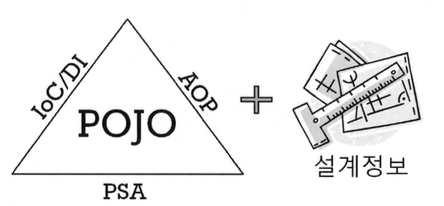
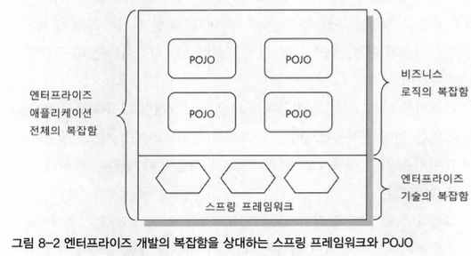

# 8.3 POJO 프로그래밍
## 8.3.1 스프링의 핵심:POJO

스프링 애플리케이션은 POJO를 이용해서 만든 애플리케이션 코드와, POJO가 어떻게 관계를 맺고 동작하는지를 정의해 놓은 설계정보로 구분된다.

DI의 기본 아이디어는 유연하게 확장가능한 오브젝트를 만들어두고 그 관계는 외부에서 다이내믹하게 설정해준다는것이다.

스프링의 주요 기술인 IoC/DI, AOP와 PSA(Portable Service Abstraction는 애플리케이션을 POJO로 개발할 수 있게 해주는 
가능기술(enabling technology)이라고 불린다.

## 8.3.2 POJO란 무엇인가
POJO는 Plain Old Java Object의 첫 글자를 따서 만든 약자다.

### 8.3.3 POJO의 조건

#### 특정 규약(contract)에 종속되지 않는다.
특정규약을 따라 만들게 하는 경우는 대부분의 규약에서 제시하는 특정 클래스를 상속하다록 요구한다.
그럴경우 자바의 단일 상속 제한 때문에 더 이상 해당클래스에 객체지향적인 설계 기법을 적용하기가 어려워지는 문제가 생긴다.
규약이 적용된 환경에 종속적이 되기 때문에 다른 환경으로 이전이 힘들다는 문제점이 있다.

#### 특정환경에 종속되지 않는다.
특정 환경에 종속적이어야만 동작하는 오브젝트도 POJO라고 할 수 없다.
특히 비즈니스 로직을 담고있는 POJO 클래스는 웹이라는 환경정보나 웹 기술을 담고 있는 클래스나 인터페이스를 사용해서는 안된다.

웹 외의 클라이언트가 사용하지 못하게 된다. 또 웹서버에 올리지 않고 독립적으로 테스트하기도 힘들어 진다.

책임과 역활이 각기 다른 코드를 한 클래스에 몰아넣어 덩치 큰 만능 클래스를 만드는 경우,
재사용이 불가능할 정도로 다른 레이어와 영역의 코드와 강한 결합을 가지고 만들어지는 경우,
상속과 다형성의 적용으로 처리하면 깔끔한 것을 if/switch 문이 가득 찬 길고 긴 메소드로 작성해놓은 경우라면 과연 그것이
객체지향적인 자바오브젝트라고 할 수 있을지 의문이다.
그런식으로 설계되고 개발된 오브젝트라면 단지 특정 기술과 환경에 종속적이지 않다고 해서 POJO라고 부르기는 힘들다.

진정한 POJO란 객제지향적인 원리에 충실하면서, 환경과 기술에 종속되지 않고 필요에 따라 재활용될 수 있는 방식으로 설계된 오브젝트를 말한다.
그런 POJO에 애플리케이션의 핵심 로직과 기능을 담아 설계하고 개발하는 방법을 POJO 프로그래밍이라고 할 수 있다.

### 8.3.4 POJO의 장점
POJO로 개발된 코드는 자동화된 테스트에 매우 유리하다.

객체지향적인 설계를 자유롭게 적용할 수 있다는 것도 큰 장점이다.
개발자들이 자바와 객체지향 프로그래밍, 모델링과 설계에 대해 배울 때 그려봤던 도메인 모델과, 오랜 경험을 통해 쌓여온
재활용 가능한 설계 모델인 디자인 패턴등은 POJO가 아니고는 적용하기 힘들다.

### 8.3.5 POJO 프레임워크
스프링은 POJO를 이용한 엔터프라이즈 애플리케이션 개발을 목적으로 하는 프레임워크라고 했다.
POJO 프로그래밍이 가능하도록 기술적인 기반을 제공하는 프레임워크를 POJO 프레임워크라고 한다.

스프링프레임워크와 하이버네이트를 대표적인 POJO 프레임워크로 꼽을수 있다.

그림 8-2 엔터프라이즈 개발의 복잡함을 상대하는 스프링 프레임워크와 POJO

그림 8-2는스프링이 엔터프라이즈 시스템의 복잡함을 어떻게 다루는지 보여준다.
스프링은 비즈니스 로직의 복잡함과 엔터프라이즈 기술의 복잡함을 분리해서 구성 할 수 있게 도와준다.
하지만 자신은 기술영역에만 관여하지 비즈니스 로직을 담당하는 POJO에서는 모습을 감춘다.
