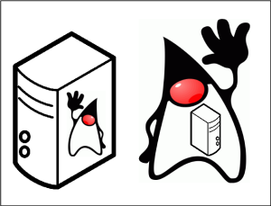

# Embedded Tomcat

## Why Embedded Tomcat 8

First of all, let's understand what embedded means. 
For a long time, Java developers shipped their applications as war (Web ARchive) and ear (Enterprise ARchive) files. 
These files, after being bundled, were deployed on application servers (like Tomcat, WildFly, WebSphere, etc.) 
that were already up and running on production servers. 
For the last couple of years, developers around the world started changing this paradigm. 
Instead of shipping applications that had to be deployed on running servers, 
they started shipping applications that contain the server inside the bundle. 
That is, they started creating jar (Java ARchive) files that are executable and that starts the server programmatically.

#### What triggered this change is that the new approach has many advantages. For example:
1.To run a new instance of the application, it is just a matter of executing a single command.

2.All dependencies of the application are declared explicitly in the application code.

3.The responsibility for running the application isn’t spread across different teams.

4.The application is guaranteed to be run in the correct server version, mitigating issues.

Also, as this approach fits perfectly in the microservices architecture 
that is eating the software development world, it makes sense to embed application servers. 
That's why we will learn how to embed Tomcat 8, the most popular Java server, on Spring applications.
